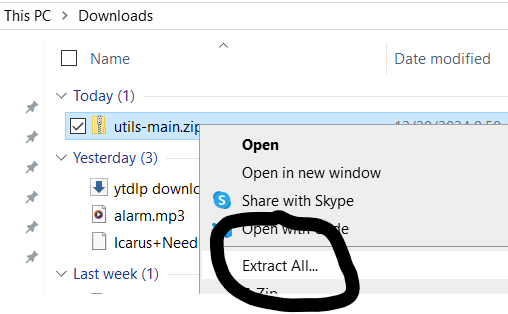

# Utility Scripts by Acolyte

A collection of AI-generated or homemade scripts for easier use of Yeshiva MP3 Players (and occasionally for tasks CAD might not approve of. Be careful!).

---

## Setup

You will need to complete the following steps once on a given computer to use these scripts. (Currently, detailed instructions are only available for Windows. If you're using a different operating system, ask someone with knowledge of Python and PowerShell.)

### 1. Install Python

1. Go to the [official Python website](https://www.python.org/) and download Python for Windows.

2. Open the installer and follow the on-screen instructions. The default options should work fine for most users.

### 2. Download This Repository

1. On this GitHub page, look near the top for a green button labeled **Code** with a down arrow.
2. Click on it, then select **Download ZIP**.

3. A zipped folder will download to your computer. Move it to a convenient location for easy access.

### 3. Opening the Repository

1. Locate the zipped folder in your file explorer, right-click on it, and select **Extract All**.

2. When the dialog box appears, click **Extract** (no changes are necessary).
3. Once extraction is complete, you'll see both a zipped folder and an unzipped folder with the same name. You can delete the zipped folder.
4. Open the unzipped folder, likely named **utils-main**.

### Folder Navigation

In the folder **Utils-Main**, there will be another named the same. In that, will be the following, and some other stuff you can ignore:

- **Simple scripts**: Start here.
- **Advanced scripts**: Read the script and customize variables before use. If you're unsure what this means, that's why they are labeled "advanced."
- **Dependencies**, **Docs**, and any files: You shouldn't need to access them.

**Note**: If the file structure looks different, this document might be outdated. Look for a folder labeled **simple** or something similar.

---

## The Scripts

### Using Them

You can run a script by double-clicking the file. If prompted to choose how to open it:
- Select the **Python** app for `.py` files.
- Select **PowerShell** for `.ps1` or `.ps` files.

### Script Descriptions

#### **number_audio.py** (Advanced)

- **Purpose**: Adds numbers to audio file names to ensure proper ordering on MP3 players.
- **Usage**: Edit the variable that stores the directory path before running the script.

---

#### **strip_files.py** (Simple)

- **Purpose**: Simplifies file names by removing a common prefix.
- **Steps**:
  1. Run the script. It will prompt you for the directory of the files.
  2. Open the folder in file explorer, click the address bar, and copy the path (e.g., `F:/SAMVIX/Music/Avraham Fried/Hebrew Gems 1`).
  3. Paste the path into the script's prompt and press Enter.
  4. Enter the common prefix (e.g., `Avraham Fried - Hebrew Gems -`).
  5. The files will be renamed to something cleaner, like `01 - Preparing for Shabbos`, `02 - Yakob`, etc.

---

#### **txtise.ps1** (Advanced)

- **Purpose**: Converts files to `.txt` format for readability on MP3 Players.
- **Limitations**: 
  - Does not convert file content (e.g., `.pdf` or `.docx` won't work).
  - Works on `.md`, code files, and basic `.html` files.
- **Warning**: Converts **every file** in the specified folder and its subfolders to `.txt`. Remove music files first.
- **Usage**: Edit the `path` variable in the script to point to the folder.

---

Enjoy using these scripts responsibly (responsibly was a contribution of AI formatting this doc, since I wrote in the beginning to use with caution. Of course, IIRC that's not the fullish meaning)!
